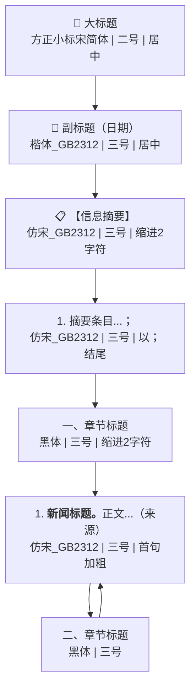

# 《格式文本版.docx》公文格式规范分析

> 文档类型：**皇岗边检站国际移民一周资讯**（内部信息简报模板）

---

## 一、页面设置

| 属性 | 值 |
|------|-----|
| 纸张 | **A4**（21.0 × 29.7 cm） |
| 方向 | 纵向（portrait） |
| 上边距 | **2.54 cm** |
| 下边距 | **2.54 cm** |
| 左边距 | **3.17 cm** |
| 右边距 | **3.17 cm** |
| 页眉距离 | 1.50 cm |
| 页脚距离 | 1.75 cm |

> [!NOTE]
> 页边距采用 Word 默认的"普通"设置（上下 2.54cm, 左右 3.17cm），而非 GB/T 9704 标准公文的 3.7cm/2.8cm 设置。这表明该文档是**内部信息简报**而非正式党政公文。

---

## 二、文档结构与段落格式

### 1️⃣ 大标题

| 属性 | 值 |
|------|-----|
| 内容 | `皇岗边检站国际移民一周资讯` |
| 中文字体 | **方正小标宋简体** |
| 西文字体 | Times New Roman |
| 字号 | **22磅（二号）** |
| 加粗 | ❌ 否 |
| 对齐 | **居中** |
| 行距 | 固定值 **28磅** |

---

### 2️⃣ 副标题（日期范围）

| 属性 | 值 |
|------|-----|
| 内容 | `（X月X日至X月X日）` |
| 中文字体 | **楷体_GB2312** |
| 西文字体 | Times New Roman |
| 字号 | **16磅（三号）** |
| 加粗 | ❌ 否 |
| 对齐 | **居中** |
| 行距 | 固定值 **28磅** |

---

### 3️⃣ 信息摘要标记

| 属性 | 值 |
|------|-----|
| 内容 | `【信息摘要】` |
| 中文字体 | **仿宋_GB2312** |
| 西文字体 | Times New Roman |
| 字号 | **16磅（三号）** |
| 加粗 | ❌ 否 |
| 对齐 | **两端对齐** |
| 行距 | 固定值 **28磅** |
| 首行缩进 | **2字符**（1.13cm） |

---

### 4️⃣ 摘要条目（正文编号列表）

| 属性 | 值 |
|------|-----|
| 示例 | `1.港将公布《香港铁路标准》推湾区应用；` |
| 中文字体 | **仿宋_GB2312** |
| 西文字体 | Times New Roman |
| 字号 | **16磅（三号）** |
| 加粗 | ❌ 否 |
| 对齐 | **两端对齐** |
| 行距 | 固定值 **28磅** |
| 首行缩进 | **2字符**（1.13cm） |

> [!IMPORTANT]
> 摘要条目注意以**分号 `；`** 结尾（文档中有明确标注）。

---

### 5️⃣ 一级标题（章节标题）

| 属性 | 值 |
|------|-----|
| 示例 | `一、涉我重要移民动态`、`二、周边国家移民要闻` |
| 中文字体 | **黑体** |
| 西文字体 | **黑体** |
| 字号 | **16磅（三号）** |
| 加粗 | ❌ 否（黑体本身视觉上即粗体效果） |
| 对齐 | **两端对齐** |
| 行距 | 固定值 **28磅** |
| 首行缩进 | **2字符**（1.13cm） |
| 编号格式 | `一、`、`二、`（中文数字 + 顿号） |

---

### 6️⃣ 正文段落（新闻条目）

正文段落包含**两部分不同格式**：

#### 导语（首句）— 加粗

| 属性 | 值 |
|------|-----|
| 示例 | `1.港将公布《香港铁路标准》推湾区应用。` |
| 中文字体 | **仿宋_GB2312** |
| 西文字体 | Times New Roman |
| 字号 | **16磅（三号）** |
| 加粗 | ✅ **是** |

#### 正文内容 — 不加粗

| 属性 | 值 |
|------|-----|
| 示例 | `据...X月X日报道，.......。（皇岗边检站）` |
| 中文字体 | **仿宋_GB2312** |
| 西文字体 | Times New Roman |
| 字号 | **16磅（三号）** |
| 加粗 | ❌ 否 |

> [!TIP]
> 每条新闻的**标题部分（至第一个句号）加粗**，后续正文内容不加粗。末尾用括号标注信息来源，如 `（皇岗边检站）`。

---

## 三、整体格式规范总结

| 规范项 | 统一设置 |
|--------|----------|
| 全文行距 | **固定值 28磅** |
| 正文字号 | **三号（16磅）** |
| 正文字体 | **仿宋_GB2312** |
| 西文字体 | **Times New Roman** |
| 首行缩进 | **2字符**（除标题外） |
| 对齐方式 | 标题居中，正文两端对齐 |
| 大标题字体 | **方正小标宋简体，二号（22磅）** |
| 副标题字体 | **楷体_GB2312，三号（16磅）** |
| 一级标题字体 | **黑体，三号（16磅）** |
| 新闻首句 | **加粗** |

